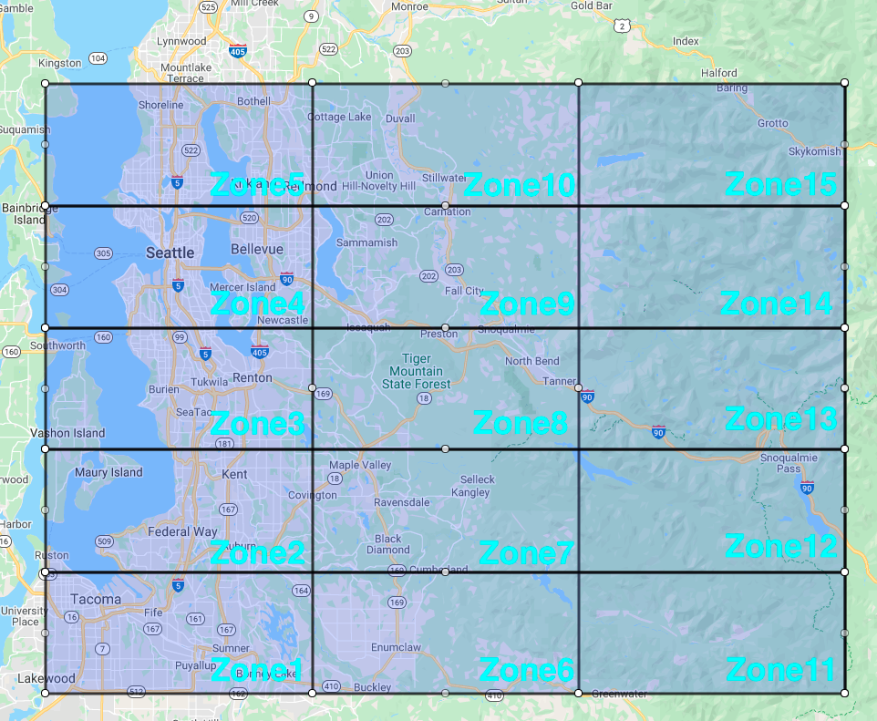
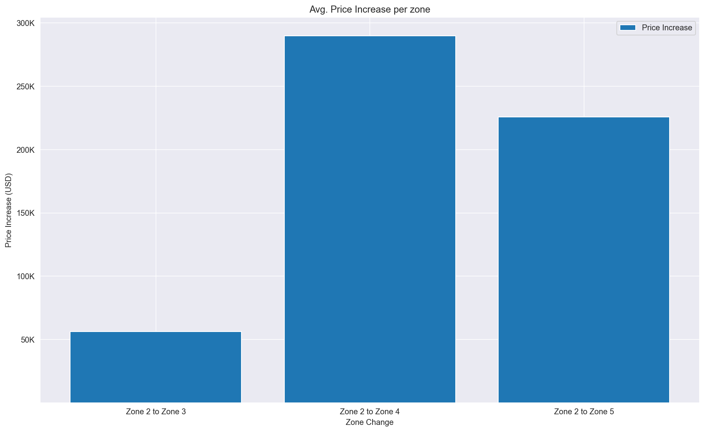
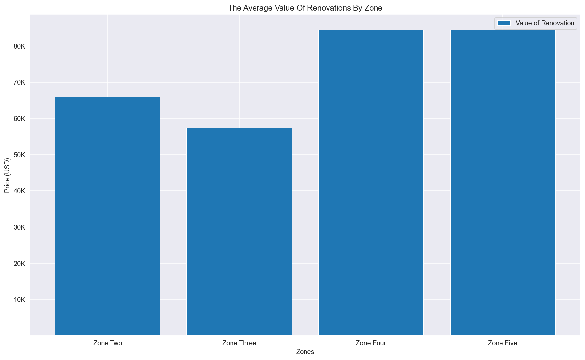
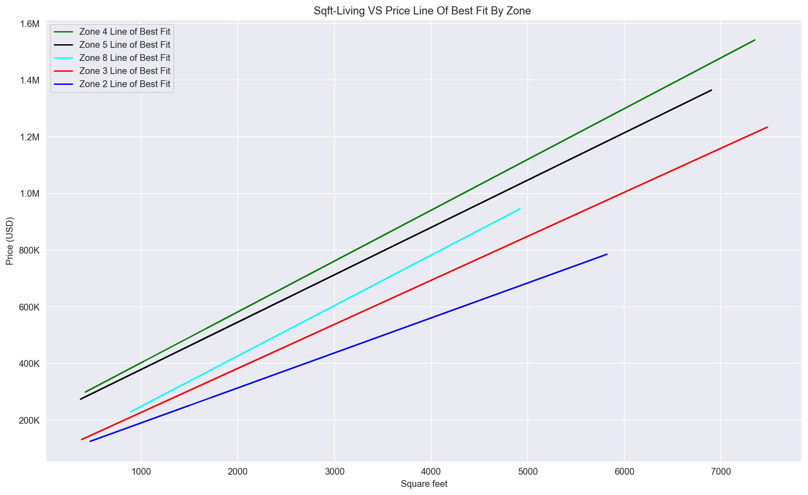

# King County Housing Data Analysis


# Project Overview

This repository analyzes the data on the King County homes sales in order to fulfill a business need. The objective is to build various ordinary least squares regression models until there is a model that can meet business expectations. Using various statistic techniques I was able to improve regression models by carefully analyzing model outputs. e.g. R^2, Mean Absolute Error, Coefficient P-values, and visual inspections too. The regression techniques provide insight into what variables affect home price and by how much. Additional analysis yielded what variables affect home price and by how much specific to geographical boundaries.

# Business Problem

The real estate market is facing a big problem, price gouging. Large companies are buying homes in bulk to rent/sell them at profitable margins. Home seeking individuals and families are competing against enterprise analytics and tactics. To mitigate this social/economic pitfall, Google is developing an open source real estate analysis project. The end product will provide users with information regarding real estate market trends at any geographical scale. I have been assigned to provide insights into the real estate market in King's County WA. User's will need to know which aspects of homes in Kings County will impact sale price the most. Users will also need to how areas within the county affect price. This predictive model and analysis will provide insights into the impact of house features on sale price.  

This product will empower small real estate seekers with industry grade analytics an no cost.

# The Data
This project uses the King County House Sales dataset, which can be found in kc_house_data.csv in the data folder in this repo. The dataset included houses in King County built between 1900 and 2015. The descriptions of the dataset's columns is shown below.

id: unique identification for the house
date: the date the house was sold
price: Price of the home
bedrooms: number of bedrooms
bathrooms: number of bathrooms
sqft_living: sqft of the home
sqft_lot: sqft of the lot
floors: number of floors
waterfront: house with a view to waterfront
view: has been viewed
condition: condition of the home overall
grade: overall grade given based on King County system
sqft_above: sqft of house apart from basement
sqft_basement: sqft of basement
yr_built: year the home was built
yr_renovated: year when home is renovated
zipcode: zipcode
lat: latitude coordinates
long: longitude coordinate
sqft_living: sqft of living space for the nearest 15 neighbors
sqft_lot15: sqft of land of the nearest 15 neighbors

# Clean

## Columns with NaN values are:

__waterfront__ (float64)

__view__ (float64)

__yr_renovated__ (float64)

### Dealing with NaN columns
1. __waterfront column__: The waterfront column is a binary column where 0 means there is not a waterfront attached to the house and 1 means that there is. Based on this, we can assume NaN values represent 0.

2. __view column__: This column represents the amount of times a house has been viewed. This column needs to be inspected later to see if it is useful. In the meantime, the column only has 63 NaN values and we can assume NaN means 0 i.e. not viewed.

3. __yr_renovated column__: I will change this column to a binary column because there are too many missing values, 21% of all the values. I will change it to either 1.0 where the house has been renovated and 0 where the house has not been renovated. It may also help the model to add a time distance between the last renovation. Houses that have not been renovated would just have the time since they were built.

## Columns with non-integer data types
__date__ (object) when the house was sold

__sqft_basement__ (object)

### Dealing with non-integer columns
1. __date column__: In this column I will convert to a number that represents how long before the house was purchased.

2. __sqft_basement column__: This column seems to be an object for no reason. I will simply convert all the data to a numeric type.

## Outliers

Based on the high outliers causing a right skew I will remove the top 5% of the data. i.e. House price > 1,160,000 will be removed.


# Analysis


The baseline model was built using only sqft_living as the independent variable because that is the most correlated variable to house price. From there, I added variables based on their correlation to price. Then, I added features such as latitude zones, latitude/longitude zones, and postal zones. The final model ended up being able to explain 72.3% of the variance (R^2). The mean absolute error is 82,773 which mean the average amount our prediction will be is 82,773. The model does not violate any of the Gauss Markov Assumptions. Limiting the range of house prices would provide better fit models.

# Conclusions

As I expected, the biggest driver of house price is sqft of the house. Regarding King County in general I found the following statements to be true:

1. For every 1 unit increase in age, price increases 1001.1757
2. For every 1 unit increase in sqft_living, price increases 115.5625
3. For every 1 unit increase of floors, price increases 25,430.0
4. Having a house with a waterfront rather than not, price increases 195,400.
5. Getting a renovation rather than not, price increases 39,020
6. For every 1 unit increase in views, price increases 34,490.0

 


However, my intuition is that houses prices exist on a scale relative to their geographical location. The entirety of King County cannot be generalized. From this intuition I built latitude/longitude zones based on the lat and long columns provided in the data set. From there, I investigated the difference in home prices, how much a renovation adds to a home's value, and sqft_living's relationship to home price per applicable zones.






This chart shows how different home prices are within the same county, simply based on location. It also tells that zone 4 is likely have the highest valued homes.



This chart shows that renovations in zone 4 and zone 5 are worth more than other zones.



This line of best fit graph shows that the relationship between sqft_living and price is different based on location.

# Author

Vincent Welsh
Github: Eucalyptusss
LinkedIn: https://www.linkedin.com/in/vincent-404/


```python

```
